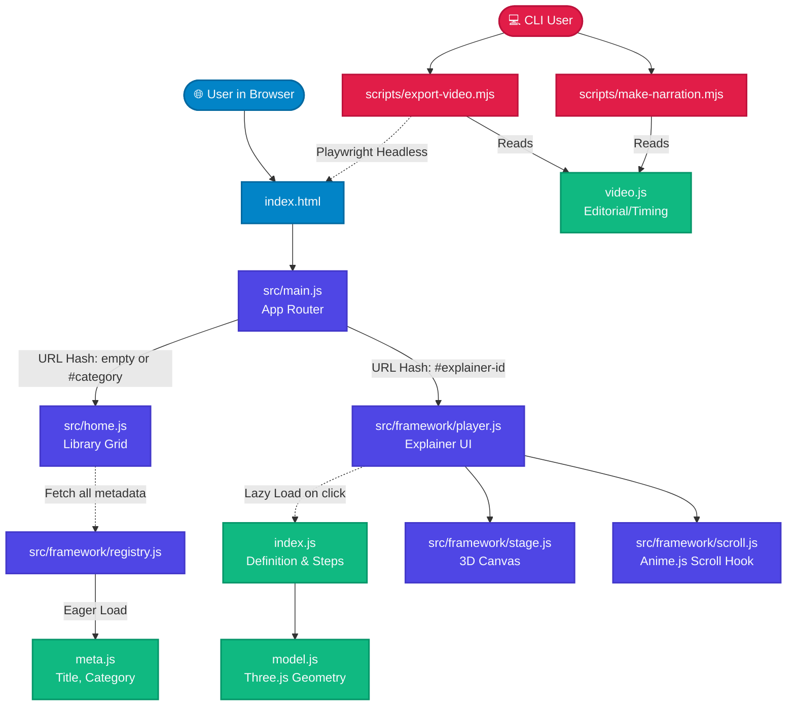

# HowItWorks: High-Level Design & Architecture

This document breaks down the directory structure of the `howitworks` project and provides a High-Level Design (HLD) architecture diagram so you can easily visualize how everything connects.

## High-Level Design (HLD) Architecture

The following diagram maps out how the different systems interact in both the **Web Application Flow** and the **Video Export Flow**.

---

## Directory & File Breakdown

### 1. Root Configuration & Entry
- **`index.html`**: The single HTML page that loads the app. It provides a simple `

` mount point.
- **`package.json`**: Lists the project's dependencies (Vite, Three.js, Anime.js) and the scripts to run the dev server or build the bundle.
- **`.claude/skills/`**: Contains the AI instructions (SKILL.md). These are rulebooks that ensure AI agents generate and polish 3D models with strict adherence to the project's realism and architectural guidelines.

### 2. Automation Scripts (`scripts/`)
These Node scripts run outside the browser and are meant for content creation.
- **`export-video.mjs`**: Uses Playwright to run the web app in a headless browser. It hijacks the internal clock to capture stutter-free screenshots and stitches them into a smooth MP4 video via FFmpeg.
- **`make-narration.mjs`**: Reads the narration script for an explainer and hits the ElevenLabs (or MS Edge TTS) API to generate MP3 voiceovers.
- **`review-shots.mjs`**: A utility to quickly review the exported shots or frames.

### 3. Application Core (`src/`)
This is the heart of the web application.
- **`main.js`**: The global router. It listens to URL hash changes and switches the view between the homepage and a specific 3D explainer.
- **`home.js` & `categories.js`**: Handles the rendering of the "Library" homepage grid, categorizing explainers under groups like "Vehicles" or "Appliances."
- **`style.css`**: The global stylesheet for the layout, panels, typography, and progress rail.

### 4. The 3D Engine (`src/framework/`)
This folder contains the reusable engine that runs every explainer.
- **`registry.js`**: Automatically detects explainers in the codebase. It instantly loads the small `meta.js` files for the homepage, and defers loading the heavy 3D files until you click on them.
- **`player.js`**: The UI overlay that runs when viewing an explainer. It builds the text panels, the background 3D canvas, and triggers camera movements as you scroll down the page.
- **`stage.js` & `scroll.js`**: `stage` bootstraps the Three.js 3D scene (lights, camera, renderer). `scroll` hooks Anime.js into the browser's scrollbar so that animations play back-and-forth as you scroll.
- **`geometry.js`, `textures.js`, `parts.js`**: Helper utilities for generating standard 3D shapes (like pipes, gears) and realistic materials (like brushed metal or clearcoat glass) procedurally, without needing external assets.

### 5. Content Modules (`src/explainers/`)
Every folder inside here (like `air-conditioner/`, `jet-engine/`) is an isolated "module."
- **`meta.js`**: Contains lightweight library-card data (ID, title, blurb, category). Loaded instantly by the home page.
- **`index.js`**: The storyboard. It defines the "steps" of the explainer, dictating the camera angles and which part of the 3D model animates during each step.
- **`model.js`**: The raw 3D code. It procedurally draws every pipe, gear, and casing using Three.js logic.
- **`video.js`**: The editorial script. Used strictly by the Node export scripts to define timing, text captions, and narration for the final video output.
